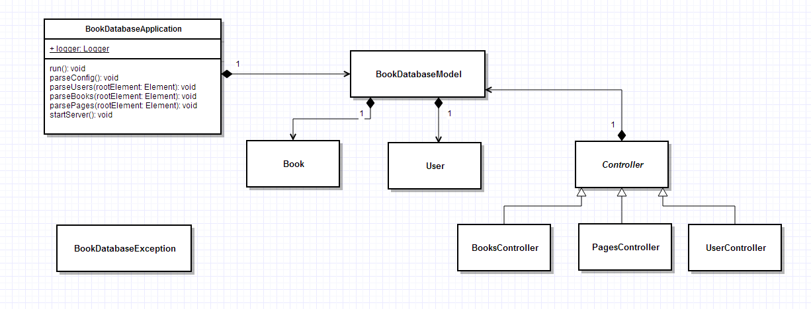
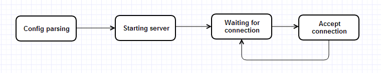
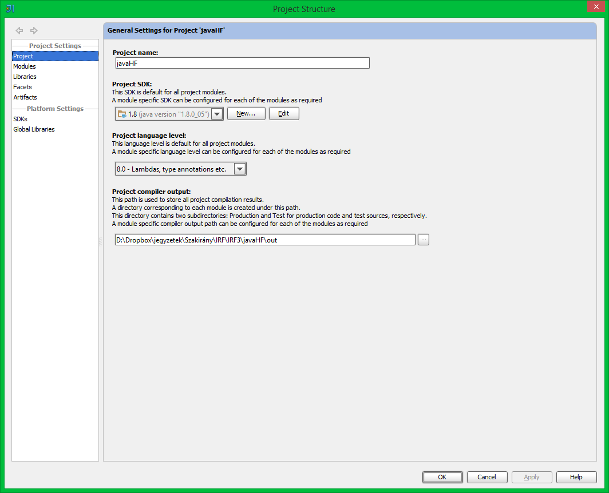

# Intelligens rendszerfelügyelet Java házi

Ezt a Java házit a Intelligens rendszerfelügyelet tantárgyhoz készítettem a BME-s tanulmányaim során a 2013/2014/2 félévben.

## Feladat

### Kerettörténet

Cégünket korábban egy olyan alkalmazás elkészítésével bízták meg, amely egy IMDB-hez hasonló könyvnyilvántartást valósít meg. Az alkalmazás jelenlegi verziójában lehet könyveket listázni, valamint az arra jogosult felhasználók bejelentkezés után új könyveket adhatnak hozzá, azokat módosíthatják, illetve törölhetik. Olyan kérés is érkezett a megrendelőtől, hogy tegyük lehetővé azt, hogy az alkalmazást egyszerűen és hatékonyan tudják üzemeltetniés gyors visszajelzést kapjanak a szoftver működéséről.

Az egyik kollégánk elkészítette a szoftverprototípusát, ami egy REST hívásokra válaszoló szerver. Aszoftver„üzleti logika” része működik, a csillogó-villogó mobiloswebes felületeivel egyelőre még nem foglalkozunk, mert jelenleg a program felügyelhetőségét kell megoldanunk.

Hogy a felhasználók viselkedését jobban nyomon tudjuk követni, és az esetleges hibák okát könnyebb legyen kideríteni, az első feladatunk azalkalmazás kiegészítése naplózással.

A probléma megoldására a legalkalmasabb megközelítés az alkalmazás kiegészítése úgy, hogy a ***log4j*** keretrendszer segítségével naplózzon.

### A program használata

A program az alábbi paranccsal indítható:

```java
java -jar BookDatabase.jar <port> <configxml>
```

A konfigurációs fájl a felhasználókat és a kezdeti könyveket tartalmazza, aprogramhoz mellékeltünk egy példafájlt is.

A szerver a felhasználók HTTP kéréseire válaszol. Ilyen kérés egyaránt küldhető *telnet* kliens és *curl* segítségével is, azonban egy REST kliens használata a javasolt (ilyen szinte minden böngészőhöz elérhető). Az elérhető funkciókat a */pages/help* oldal sorolja fel, valamint a programhoz mellékelt README fájl egy rövid szcenáriót is tartalmaz.

### 1. feladat: Ismerkedés az alkalmazással

Hogy jobban megértsük az alkalmazás működését, a forráskód tanulmányozásával készítsünk egy UML modellt (tipikusan komponens vagy osztálydiagramokkal), ami ábrázolja a rendszer főbb részeit és azok kapcsolatait. A modell tartalmazza, hogy melyik komponens milyen adatot tárol, hogyan kommunikálnak egymással a komponenseink, tipikus esetbenmelyikből hány darab fut stb.

El kell készítenie továbbá a szoftver állapotait bemutató modellt (UML State Machine) is.

Az elkészült modellekről egy-egy exportált képet kell leadni a megoldásban.

**Figyelem:** nem egy reverse engineeringeszközzel előállított részletes osztálydiagramot kérünk, hanem egy saját modellt, ami csak az alkalmazás fontosabb részeit ábrázolja!

### 2. feladat: Felügyeleti modellelkészítése

Döntsük el, hogy a kiszolgáló komponensnek milyen, a működésével kapcsolatos eseményeket kellene rendszerfelügyeleti célokra elérhetővé tennie! Az eseményeket specifikáljuk legalább a következő adatokkal:

  - esemény azonosítója (integer),
  - esemény súlyossága,
  - esemény szövege,
  - az esemény definíciója (annyira formálisan és részletesen, hogy az további pontosítás nélkül implementálható legyen).

***Legalább nyolc*** esemény definiálását várjuk el, ezek között kell lennie Error vagy Warning, Information és Verbose súlyosságú eseménynek is.Egyaránt definiáljunk eseményeket a kiszolgálóra és azalkalmazáskomponensekre is.

### 3. feladat: Naplózás megvalósítása

***Log4j*** instrumentáció hozzáadásával és a szükséges egyéb módosításokkal érjükel, hogy a kiszolgáló a fent definiált eseményeketnaplózza!Felhívjuk rá a figyelmét, hogy a kiadott kódban a hibakezelés szándékoltan részleges és elnagyolt, annak rendbetétele a feladat részét képezi.

A feladat megoldásának része az a mérnöki érvelés, hogy hány különböző helyre és milyen logika szerint naplóz azalkalmazás.

### További követelmények

  - A tesztelés tartalmazza az összes esemény kiváltásának módját és azok naplózásánakbemutatását.
  - Az alkalmazásújpublikus elemeihez kötelező Javadoc típusú kommenteket készíteni.
  - A megoldás soránlehet, hogymódosítani kell az eredeti forráskódot. A forrásfájlok új verzióján kívül a leadott csomagba rakjon be difffájlokat is(unified diff formátumban1), melyek a módosításokat jelzik.

## Dokumentáció



**Class Diagram**: A képen megjelenítettem a BookDatabaseApplication osztályt részletesen, mert a legtöbb logolás ezen belül történik. A többi szerintem fontos osztályt pedig csak egy simpla class-ként jelenítettem meg, a részletek megmutatása nélkül.


**State Diagram**: A program a config fájl parsolásával kezdõdik, majd ha ez sikeres, akkor elindítja a szervert. A szerver elindulása után egy végtelen ciklusba kerül, ahol várakozik a kliensek csatlakozására. Ha valaki csatlakozik, akkor azt elfogadja, majd visszatér a várakozáshoz.

A feladat megoldásához egy hivatalos mintaházifeladatot használtam:
https://inf.mit.bme.hu/edu/courses/materials/intelligens-rendszerfel%C3%BCgyelet/2011-tavasz/irf-h%C3%A1zi-feladat-mint%C3%A1k
https://inf.mit.bme.hu/sites/default/files/materials/category/kateg%C3%B3ria/oktat%C3%A1s/bsc-t%C3%A1rgyak/intelligens-rendszerfel%C3%BCgyelet/11/IRF_HF_minta_3B.pdf



A feladathoz létrehoztam egy IDEA projektet. A projekthez JDK 8-at használtam és a langueage level az 8.0. A log4j hozzáadását az IDEA-n belül oldottam meg. Letöltöttem az 1.2.16-os verziót, majd:
1. File/Project Structure/ Libraries
2. Hozzáadtam a log4j .jar file-ját. A fájlt beraktam a .lib mappába is egyébként.

A logoláshoz létrehoztam egy logger.properties fájlt, melynek a tartalma itt látható:

	log4j.rootLogger=DEBUG, Console, File

	log4j.appender.File=org.apache.log4j.RollingFileAppender
	log4j.appender.File.File=Log.log
	log4j.appender.File.MaxFileSize=2MB
	log4j.appender.File.MaxBackupIndex=1
	log4j.appender.File.layout=org.apache.log4j.PatternLayout
	log4j.appender.File.layout.ConversionPattern=%d{yyyy.MM.dd HH:mm} [%t] %-5p %c %x - %m%n

	log4j.appender.Console=org.apache.log4j.ConsoleAppender
	log4j.appender.Console.Threshold = INFO
	log4j.appender.Console.layout=org.apache.log4j.PatternLayout
	log4j.appender.Console.layout.ConversionPattern=%d{yyyy.MM.dd HH:mm} [%t] %-5p %c %x - %m%n

A rootloggernek megadtam, hogy debug, vagy annál fontosabb üzeneteket logoljon. Két helyre logol:
- Konzolra az olvashatóság érdekében csak INFO-t logol (threshold beállítás)
- Fájlba pedig mindent, és mindig a Log.log fájlhoz hozzáfûzi. A fájl mérete max 2 MB lehet, ha ez megtelik, akkor új fájlt fog kezdeni. A fájl a projekt gyökerébe/a futtatható jar fájl mellé kerül futtatáskor.

### Események

Ebben az esetben a debug megegyezik a verbose-al.

ID, Fontosság,  Szöveg/def Elõfordulás a kódban

BookDatabaseApplication.java fájlban:
```
1, info,  	Configuration parsing was succesful! / A konfigurációs fájl sikeresen betöltõdött. 97. sor

2, info,  	Socket created! Waiting for connections! / Létrehoztuk a socket-et, kliensekre várakozunk. 219. sor,

3, info,  	Client connected! / Sikeres csatlakozás. 228. sor

5, debug,  	Parsing X!, No books to parse! / Információ szerû debug események, hogy a nagyobb folyamatok belsejét is láthassuk a naplózásban. 77. sor, 108. sor, 145. sor, 147. sor, 195. sor, 197. sor,

6, debug, X parsing was succesful! / Valaminek a beolvasása sikeresen megtörtént. 140. sor, 190. sor, 212. sor

7, error,  	Parsing the configuration was unsuccesful! / A konfigurációs fájl beolvasása sikertelen volt. 92. sor, 99. sor

8, error,  	User parsing was unsuccesful! / A user parse-olás sikertelen volt. 110. sor, 126. sor

9, error,  	Book parsing was unsuccesful! / A book parse-olás  sikertelen volt. 167. sor,

10, error, Client connection was unsuccesful! / A kliens csatlakozása sikertelen volt. 233. sor

11, error, Starting server was unsuccesful! / A szerver elindítása sikertelen volt. 65. sor, 240. sor
```


UserController.java fájlban:
```
13, info, Logout OK. / Sikeres kijelentkezés. 89. sor

14, info, User was not logged in. / Nem volt bejelentkezett felhasználó.  93. sor

15, warning, Logout was unsuccesful. / A kilépés során hiba lépett fel. 99. sor

16, info, Login OK. / Sikeres bejelentkezés. 49. sor

17, info, Invalid credentials. / A bejelentkezéshez szükséges adatok nem megfelelõek. 54. sor

18, warning, Login was unsuccesful. / A bejelentkezés során hiba lépett fel. 60. sor
```

Book.java fájlban:
```
4, info,  	New book creation was succesful! / sikeresen létrehoztunk egy új könyvet. 68. sor

12, warning, Unable to create new book! / A book létrehozása során hiba lépett fel. 60. sor
```


BooksController.java fájlban:
```
19, info, User is not logged in. / A felhasználó nincs bejelentkezve. 84. sor

20, info, Book deleted. / A könyv törölve lett. 122. sor

21, info, Book not found. / A könyv nem található.	127. sor

22, warning, Error while deleting book. / A könyv törlése során hiba lépett fel. 140. sor

23, warning, Error while adding book. / A könyv hozzáadása során hiba lépett fel.	90. sor
```

## Tesztelés

A tesztelések során sokszor kaptam warningot, amikor a Request body-t véletlenül emptyn hagytam. Amint azt kitöltöttem, már nem volt gond a programmal.

Bejelentkezés után hozzáadtam egy könvyet, és utána kilistáztam a könyveket. Látszik, hogy tényleg hozzáadta a könyvet.

A könyv törlését nem tudtam tesztelni, mert az IDEA nem engedett Request bodyt hozzáadni a DELETE-hez.
